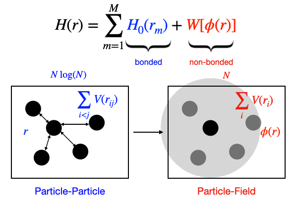

# hPF-MD.jl
## Hybrid Particle-Field Molecular Dynamics Simulation implemented in Julia



(This code is not fully benchmarked and finished.)

hPF-MD.jl is a hybrid particle-field molecular-dynamics simulation package written in Julia. It features a non-pairwise fashion to describe the non-bonded interactions between particles.

To run a test simulation:


```julia

# loading hPF-MD.jl

include("./hPF-MD/hPF-MD.jl")
using .hPFMD

# define the simulation system
sys=sys_init()

sys.data_file="input.data"         # input data file
sys.box=[9.1456,9.1456,9.1456]  # define box size

sys.dt=0.001                    # set time step
sys.temp=3.0                    # set temperature in reduced unit
sys.steps=10000                 # set number of simulation steps


sys.logfile="test_logger.dat"   # set logger file name
sys.logfreq=10                  # set frequency to log out thermo information
sys.logmode="w"                 # set logger mode, 'w': new file; 'a': continue write
logger=logger_init()            # initialize a logger
logger.PotentialEnergy=true     # output potential energy
logger.KineticEnergy=true       # output kinetic energy
sys.logger=logger

sys.trjdumpfile="test.lammpstrj" # set trajectory file name (available: XYZTrajectoryDump, LAMMPSTrajectoryDump)
sys.trjdumpfreq=1000             # set frequency to write trajectory
sys.trjdumpmode="w"              # set trajectory mode, 'w': new file; 'a': continue write
sys.trajectorydump=LAMMPSTrajectoryDump(false,false,true,false)

sys.thermostat=AndersenThermostat(200) # define a thermostat (available: BerendsenThermostat, AndersenThermostat)

mesh=init_mesh([9.1456,9.1456,9.1456],10,10,10)             # initialize a mesh for the field
sys.nonbondinteraction=OriginalhPFInteractions(0.1,mesh)    # define the type of the non-bond interaction

@time run_hPFMD(sys)             # Run hPF-MD!!!
```

references:
1. Milano, G.; Kawakatsu, T. Hybrid Particle-Field Molecular Dynamics Simulations for Dense Polymer Systems. The Journal of Chemical Physics 2009, 130 (21), 214106. https://doi.org/10.1063/1.3142103.
2. Bore, S. L.; Cascella, M. Hamiltonian and Alias-Free Hybrid Particle–Field Molecular Dynamics. J. Chem. Phys. 2020, 153 (9), 094106. https://doi.org/10.1063/5.0020733.
3. Wu, Z.; Kalogirou, A.; De Nicola, A.; Milano, G.; Müller‐Plathe, F. Atomistic Hybrid Particle‐field Molecular Dynamics Combined with: Restoring Entangled Dynamics to Simulations of Polymer Melts. J Comput Chem 2021, 42 (1), 6–18. https://doi.org/10.1002/jcc.26428.
4. Wu, Z.; Milano, G.; Müller-Plathe, F. Combination of Hybrid Particle-Field Molecular Dynamics and Slip-Springs for the Efficient Simulation of Coarse-Grained Polymer Models: Static and Dynamic Properties of Polystyrene Melts. J. Chem. Theory Comput. 2020. https://doi.org/10.1021/acs.jctc.0c00954.
